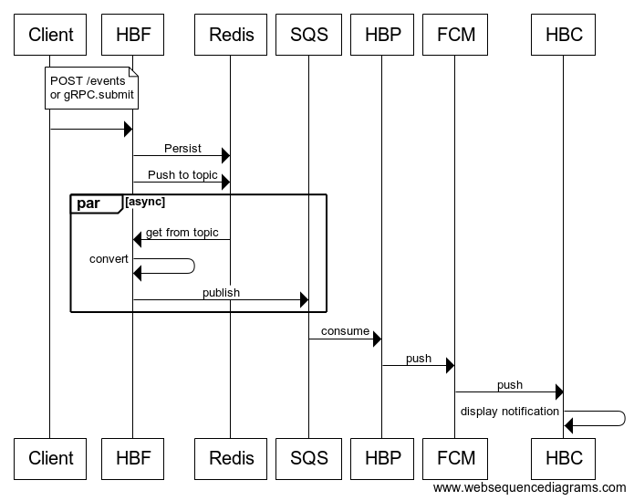

# HeartBeatFunnel
Entry point application for delivering a webhook notification to Android client.

## Flow description

### Diagram legend
* HBF - https://github.com/vadymc/HeartBeatFunnel
* Redis - https://redis.io/. Used for separation of event posting and event processing
* SQS - https://aws.amazon.com/sqs/
* HBP - https://github.com/vadymc/HeartBeatPublisher for Spring Boot deployment, or https://github.com/vadymc/HeartBeatPublisherLambda for https://aws.amazon.com/lambda/ deployment
* FCM - https://firebase.google.com/docs/cloud-messaging/
* HBC - https://github.com/vadymc/HeartBeatClient Android client

## Build and push docker image
```
docker login
docker build -t vadymchekrii/heartbeat:latest .
docker push vadymchekrii/heartbeat:latest
```

## Runtime
The following environment variables have to be passed:
```
AWS_REGION
AWS_SECRET_ACCESS_KEY
AWS_ACCESS_KEY_ID
jasypt.encryptor.password
```
